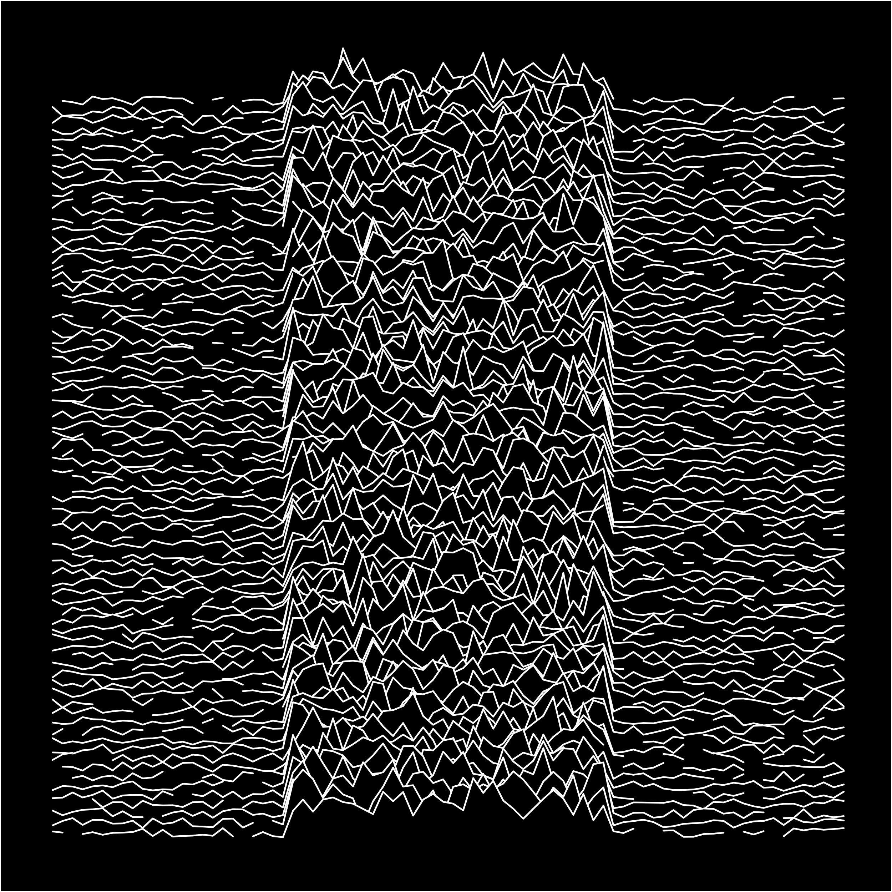

# joy_plots
A repository for making generative and location based joy plots! 

## The generated


colourful | classic
:--------:|:--------:
 | 
 | 
 |

## The location based

Both examples here are of the same place, the UK county of Berkshire. 

colourful | classic
:--------:|:--------:
 | 


## Code examples

As much as possible, all key functionality is written as a function to streamline making the visuals. The functions used can be found in the functions folder.

Libraries used are listed below in categories. 

```
# spacial
library(sf)
library(terra)
library(giscoR) # Shapes
library(elevatr)

# Data viz and wrangling
library(ggplot2)
library(dplyr)
library(ggridges)
library(MetBrewer)

# random generation
library(ambient)

# fonts
library(showtext)
```

The code below makes the data for perlin and simplex noise versions. You can adjust multiple parameters to change the appearance.
It also includes simple code using the `ggridges` package and `ggplot2` to make the visual from the data. 

```
df <- make_noise_elev() %>%
  joy_df_noise()
  
ggplot(df, aes(lat, long, group = long, height = elev)) +
  geom_density_ridges(stat = "identity",
                      fill = "black",
                      scale = 10,
                      linewidth = 1) +
  my_theme()
```

The location data functions are more streamlined. Below you find a location using a *nuts ID*, adjust the rows, then plot. 
We used the `gisco` library here. You can get the ids from different countries by, e.g. the UK by using the following code: `gisco_get_nuts(country = "UK")`.

Special mention, a lot of the code for this section comes from this [cool blog](https://dieghernan.github.io/202205_Unknown-pleasures-R/). 

```
r <- region_data(nuts_id = "UKJ11") # testing Berkshire

d <- dem_data(region = r, zoom = 7, row_target = 90)

joy_standard(region_data = r, df = d, scale = 25) +
  my_theme()
```

To do list is to make better ggplot wrappers for the generated datasets. 
